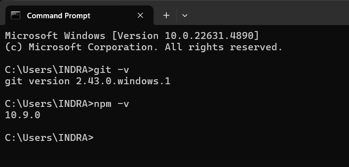
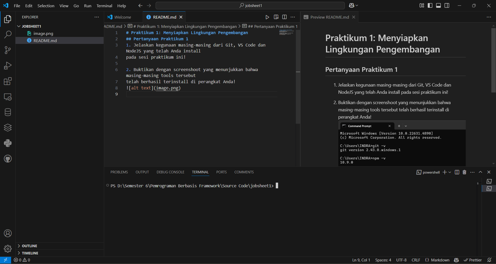
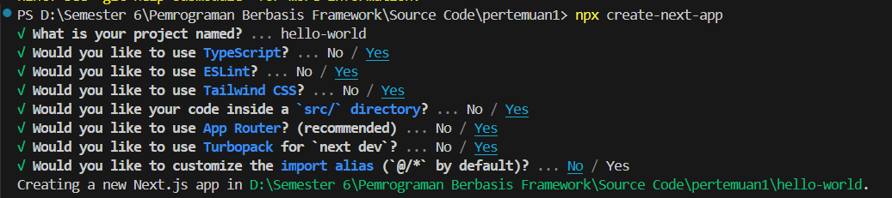
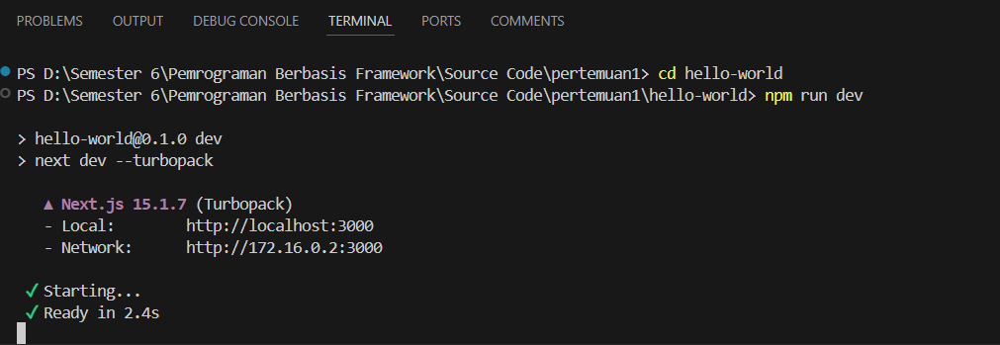
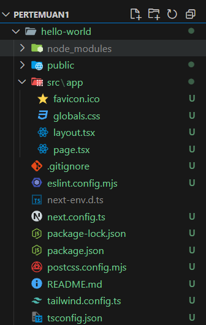
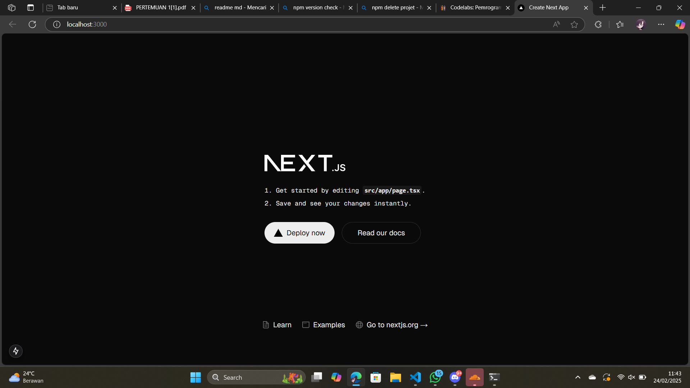
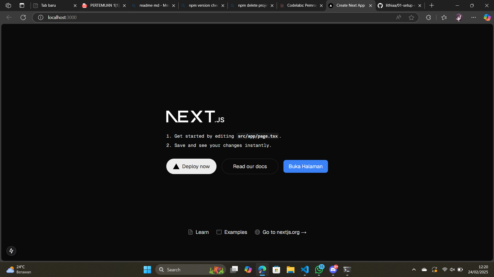
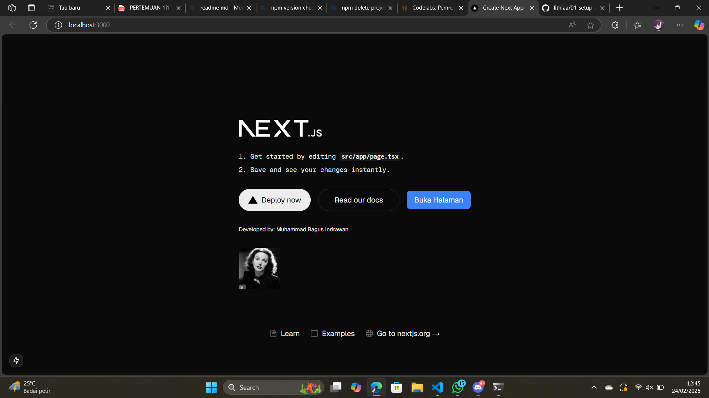

# Praktikum 1: Menyiapkan Lingkungan Pengembangan 
## Pertanyaan Praktikum 1 
1. Jelaskan kegunaan masing-masing dari Git, VS Code dan NodeJS yang telah Anda install 
pada sesi praktikum ini! 

- Git digunakan untuk melacak perubahan source code selama proses pengembangan.
- VS Code digunakan sebagai editor source code dalam proses pengembangan.
- Node JS digunakan untuk membangun aplikasi berbasis jaringan yang bersifat scalable.

2. Buktikan dengan screenshoot yang menunjukkan bahwa masing-masing tools tersebut 
telah berhasil terinstall di perangkat Anda!

# Praktikum 2: Membuat Proyek Pertama React Menggunakan Next.js
## Pertanyaan Praktikum 2 
1. Pada Langkah ke-2, setelah membuat proyek baru menggunakan Next.js, terdapat beberapa 
istilah yang muncul. Jelaskan istilah tersebut, TypeScript, ESLint, Tailwind CSS, App 
Router, Import alias, App router, dan Turbopack! 

2. Apa saja kegunaan folder dan file yang ada pada struktur proyek React yang tampil pada 
gambar pada tahap percobaan ke-3! 

3. Buktikan dengan screenshoot yang menunjukkan bahwa tahapan percobaan di atas telah 
berhasil Anda lakukan! 

# Praktikum 3: Menambahkan Komponen React (Button)
## Pertanyaan Praktikum 3 
1. Buktikan dengan screenshoot yang menunjukkan bahwa tahapan percobaan di atas telah 
berhasil Anda lakukan!

# Praktikum 4: Menulis Markup dengan JSX
## Pertanyaan Praktikum 4 
1. Untuk apakah kegunaan sintaks user.imageUrl? 
    
    Sintaks `user.imageUrl` digunakan untuk mengambil gambar dari tautan yang dideklarasikan pada properti imageUrl dari objek user. Pada source code praktikum, user.imageUrl dipanggil dalam komponen Profile sebagai sumber (src) untuk elemen image ``, sehingga gambar dari tautan tersebut dapat ditampilkan pada halaman web.
2. Buktikan dengan screenshoot yang menunjukkan bahwa tahapan percobaan di atas telah 
berhasil Anda lakukan!

